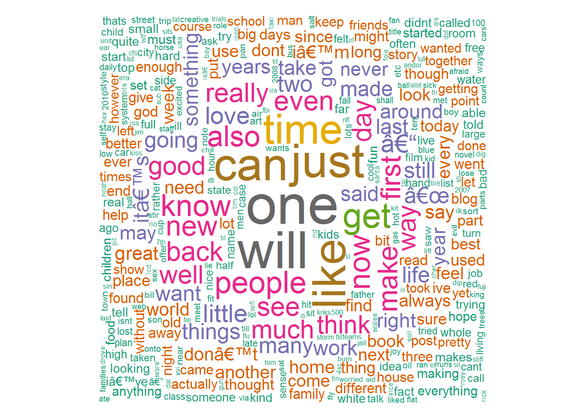

# Coursera Johns Hopkins Capstone Project for Data Science Certification
## John Withrow, PhD
## November 27, 2016


## Executive Summary
An application that makes use of legacy text data to predict a word based upon preceding word or words is desired.  We are provided with three text files from which term-document matrices can be generated using the R package "tm".  The specifics of this analysis are achieved through the creation of a new package "tmn", which extends the capabilities of "tm" to include a higher-order term-document matrix that not only stores instances of a single term in a document, but also instances of a single combination of n terms in a document.  It is by way of this package that, given a new sequence of text, predictions can be made of the next word to follow.

## Introduction
The R software Environment (R Core Team 2016) is an open-sourced statistical software that is enjoying increased popularity due in no small part to the variety of user-created packages that diversify its applicability.  As an example, systems for doing text mining in R have been developed (Feinerer et al. 2008), which in addition to creating a foundational data structure for the management of a library of textual resources, also creates a foundational object for storing the essentials of word frequency so that the need for memory resources is minimized.

This text mining package in question is called "tm", and the fundamental object for the compilation of a set of one or more text documents is called a "corpus".  For the present work, three separate "corpora" are created, each containing a single text file of considerable size.  The three corpora will allow for three separate analyses on three sets of data from different sources - blogs, news feeds, and twitter feeds, respectively.  Part of the challenge of this present study involves producing an algorithm that predicts a word to follow a set of one or more words without having to load the entire text file to deduce an answer.  How does one create a helpful but streamlined summary object in memory that sufficiently represents the data stored in the corpora on disk?  Perhaps even the summary object itself will require itself to be primarily stored on disk with only a featured portion of it loaded into memory at one time for the algorithm to produce a timely answer using minimal resources.

From the perspective of the "tm" package, this summary object is known as a "term-document matrix", a type S3 Object in R that stores key words existing in one, many, or all of the text documents in a given corpus.  It also stores which documents in the corpus contain each word as well as the number of times the given word exists in the given document.  These types of objects allow for the efficient creation of graphical output figures such as "word clouds" as well as analytical processes such as authorship prediction, authenticity assessment, and sentiment analysis.

Traditionally this process has been preceded with various data cleanup procedures, including:

1. Profanity removal
2. Punctuation removal
3. Removal of common words (known as "stopwords" - that is, words that reveal little about the distinguishing character of the text)

This is followed by the creation of the term-document matrix, which, although showing information about counts of single words in text documents, does not show information on the presence of word sequences in text documents.  The efficient storage of such word sequences is vital to the present application of word prediction.  

The Methods Overview section summarizes in a non-technical manner the process of making the necessary expansions to the term-document matrix and the necessary modifications to the traditional preceding data cleanup procedures.  The Technical Discussion describes this in more detail and tailored to an audience of more savvy R programmers.  The Initial Results section gives some introductory statistical analyses of the three given corpora, and the Final Methodology section shows the final preprocessing of the corpora and the usage of the extended term-document matrix package.  Finally, the Usage and Discussion section describes the implementation of this new algorithm, which is intended to be visually displayed by way of a web application using the "shiny" package in R.

## Methods Overview

We begin with modifications of the traditional data cleaning process.  For our purposes, although profanity and punctuation removal will be appropriate, the removal of common words is not, since the word to be predicted will sometimes itself be a stopword, and may be predicted based upon a sequence containing one or more stopwords.  For the purpose of predicting words to follow, all words are necessary.  In addition, although profanity and punctuation is to be removed, their presence must still be acknowledged after their removal.  This is to prevent the prediction of a word based on a preceding phrase now containing a missing word or the start of a new sentence.  It is decided that this will be handled by not simply removing profanity and punctuation, but rather replacing it with a distinguishing marker - "!w0r&" - a hopefully sufficiently esoteric character sequence (indicating 'not word') so as to not be confused by anything else in any text document.

Further term-document matrices will be initially done on all three corpora in an effort to perform suitable "!w0r&" replacements of other unhelpful document peculiarities that will certainly arise (e.g., numeric values, twitter names, hashtags, etc.)

Apparently to save on memory and/or storage resources, term-document matrices generated using the current "tm" package store all featured words in a single list, so that all references to that word's usage in documents is done merely by referencing the integer position of that word in the list.  The same is done for all documents, where all document references are done by a similar integer indication of the item on the document list.  This allows for the remainder of the term-document matrix to take the form of three other lists of only integers, one list pointing to specific documents, one pointing to specific words, and one showing the number of times the referenced word appeared in the referenced document.

Following this lead, the storage of sequences of two words can be done with the addition of four more lists of integers.  One list would actually be two columns of integers, both columns referencing words on the word list.  This list would show all two-word combinations.  The latter three lists would be similar to the latter three above - a list referencing a specific two word combination, a list referring to a specific document, and a third list showing the number of times the given word combination occurred in the given document.  

The storage of sequences of three words would be identical to the above for two word sequences except that the first list would have three columns of integers referencing three word sequences.  The storage of four word sequences would have a list showing four columns of integers, and so on.  Decisions of memory usage and efficiency may depend powerfully on the maximum length of allowed sequences and may not be extended much beyond three or four.  Such enhanced term-document matrices are hereafter referred to as nth-order term-document matrices, allowing for second-order effects (two word sequences), third-order effects (three word sequences), and so on.  This nth-order expansion is also the foundation of the name of the enhanced package - "tmn".

## Technical Discussion
*This portion is under construction and will be presented with the final project.*

## Initial Results
In this section some initial statistical findings will be illustrated, first with the blog data, then with the news data, and finally the twitter data.


### Loading Blog Data
Upon loading the blog data, a statement is generated below the code indicating the size of the total file, of which we are sampling a random subset of lines for the creation of the corpus.

```r
blogs <- readLines("C:\\Users\\John\\Documents\\DataScienceCapstone\\final\\en_US\\en_US.blogs.txt")
origLengthBlogs <- length(blogs)
sampleSizeBlogs <- 100
blogs <- unlist(blogs)[sample(seq(1,length(blogs)),sampleSizeBlogs)]
paste("Original number of lines: ",origLengthBlogs,", of which we are sampling ",sampleSizeBlogs," lines.",sep="")
```

```
## [1] "Original number of lines: 899288, of which we are sampling 100 lines."
```

### Corpus Creation, Cleanup, and Word Cloud Generation
The corpus is generated and cleaned.

```r
cpsBlogs <- Corpus(VectorSource(blogs))
cpsBlogs <- tm_map(cpsBlogs, PlainTextDocument)
#cpsBlogs <- tm_map(cpsBlogs, removePunctuation)
cpsBlogs <- tm_map(cpsBlogs, stripWhitespace)
cpsBlogs <- tm_map(cpsBlogs, tolower)
cpsBlogs <- tm_map(cpsBlogs, removeWords, stopwords(kind="en"))
cpsBlogs <- tm_map(cpsBlogs, PlainTextDocument)
```
A term-document matrix is created, from which a word cloud is generated as well as a listing of the top words.

```r
tdmBlogs <- TermDocumentMatrix(cpsBlogs)
pal <- brewer.pal(8,"Dark2")
wordcloud(cpsBlogs, min.freq=3, max.words = Inf, width=1000, height=-1000, random.order = FALSE, color=pal)
```



```r
topWordsBlogs <- data.frame(Term=tdmBlogs$dimnames$Terms[tdmBlogs$i[tdmBlogs$v>4]],Freq=tdmBlogs$v[tdmBlogs$v>4])
topWordsBlogs$EstimatedTotal <- round(topWordsBlogs$Freq*origLengthBlogs/sampleSizeBlogs)
topWordsBlogs
```

```
##    Term Freq EstimatedTotal
## 1 games    5          44964
```
Lastly, a logarithmic histogram is generated to show the distribution of words with different levels of occurrence.

```r
histBlogs <- hist(tdmBlogs$v,breaks=(seq(0,max(tdmBlogs$v))+0.5),plot=FALSE)
plot(histBlogs$mids,histBlogs$counts,log="y",axes=TRUE,xlab="Number of Instances",ylab="Number of Words",main="Histogram Showing Number of Words by Number of Instances")
```


### Loading News Data
Upon loading the news data, a statement is generated below the code indicating the size of the total file, of which we are sampling a random subset of lines for the creation of the corpus.

```r
news <- readLines("C:\\Users\\John\\Documents\\DataScienceCapstone\\final\\en_US\\en_US.news.txt")
origLengthNews <- length(news)
sampleSizeNews <- 1000
news <- unlist(news)[sample(seq(1,length(news)),sampleSizeNews)]
paste("Original number of lines: ",origLengthNews,", of which we are sampling ",sampleSizeNews," lines.",sep="")
```

```
## [1] "Original number of lines: 77259, of which we are sampling 1000 lines."
```

### Corpus Creation, Cleanup, and Word Cloud Generation
The corpus is generated and cleaned.

```r
cpsNews <- Corpus(VectorSource(news))
cpsNews <- tm_map(cpsNews, PlainTextDocument)
#cpsNews <- tm_map(cpsNews, removePunctuation)
cpsNews <- tm_map(cpsNews, stripWhitespace)
cpsNews <- tm_map(cpsNews, tolower)
cpsNews <- tm_map(cpsNews, removeWords, stopwords(kind="en"))
cpsNews <- tm_map(cpsNews, PlainTextDocument)
```
A term-document matrix is created, from which a word cloud is generated as well as a listing of the top words.

```r
tdmNews <- TermDocumentMatrix(cpsNews)
pal <- brewer.pal(8,"Dark2")
wordcloud(cpsNews, min.freq=3, max.words = Inf, width=1000, height=-1000, random.order = FALSE, color=pal)
```


```r
topWordsNews <- data.frame(Term=tdmNews$dimnames$Terms[tdmNews$i[tdmNews$v>2]],Freq=tdmNews$v[tdmNews$v>2])
topWordsNews$EstimatedTotal <- round(topWordsNews$Freq*origLengthNews/sampleSizeNews)
topWordsNews
```

```
##           Term Freq EstimatedTotal
## 1     campaign    3            232
## 2        music    3            232
## 3          law    3            232
## 4       pujols    3            232
## 5        women    3            232
## 6         just    3            232
## 7         less    3            232
## 8         just    3            232
## 9        yards    3            232
## 10      things    3            232
## 11       trade    3            232
## 12         ...    3            232
## 13     fleming    3            232
## 14      levels    3            232
## 15        will    4            309
## 16        like    3            232
## 17        like    3            232
## 18       bynum    3            232
## 19       grass    3            232
## 20        crab    3            232
## 21 restaurants    3            232
## 22        d.c.    3            232
## 23         mls    3            232
## 24      united    3            232
## 25         ...    3            232
## 26   stevenson    3            232
## 27      wilson    3            232
## 28       great    3            232
## 29      awards    4            309
## 30    national    3            232
## 31      racing    3            232
## 32         ump    4            309
## 33   trademark    3            232
## 34        ball    4            309
## 35    students    3            232
## 36       class    4            309
## 37       email    3            232
## 38        ever    3            232
## 39         usc    3            232
## 40      booked    3            232
## 41      county    3            232
## 42       jail;    3            232
## 43      orange    3            232
## 44   suspicion    4            309
## 45         ...    3            232
## 46   wilkerson    3            232
## 47     percent    4            309
## 48         â<U+0080><U+0094>    3            232
## 49        free    3            232
## 50        road    3            232
## 51        room    3            232
## 52       opera    3            232
## 53  government    3            232
## 54     chamber    3            232
## 55     charles    3            232
## 56    customer    4            309
## 57         st.    4            309
## 58         hit    3            232
## 59     perkins    3            232
## 60        vote    3            232
## 61        just    3            232
## 62      really    3            232
## 63     believe    3            232
## 64      proven    3            232
## 65       water    3            232
## 66      yogurt    5            386
## 67       music    3            232
## 68       ready    3            232
## 69      really    3            232
## 70        time    3            232
## 71        pete    3            232
## 72        park    3            232
## 73      scored    3            232
## 74         ...    4            309
## 75      points    3            232
## 76       since    3            232
## 77        know    3            232
## 78      people    3            232
## 79        will    3            232
## 80     parents    3            232
## 81         two    3            232
## 82       bhatt    3            232
## 83       april    3            232
## 84        ford    4            309
## 85    children    3            232
```
Lastly, a logarithmic histogram is generated to show the distribution of words with different levels of occurrence.

```r
histNews <- hist(tdmNews$v,breaks=(seq(0,max(tdmNews$v))+0.5),plot=FALSE)
plot(histNews$mids,histNews$counts,log="y",axes=TRUE,xlab="Number of Instances",ylab="Number of Words",main="Histogram Showing Number of Words by Number of Instances")
```


### Loading Twitter Data
Upon loading the twitter data, a statement is generated below the code indicating the size of the total file, of which we are sampling a random subset of lines for the creation of the corpus.

```r
twitter <- readLines("C:\\Users\\John\\Documents\\DataScienceCapstone\\final\\en_US\\en_US.twitter.txt")
origLengthTwitter <- length(twitter)
paste("Number of lines: ",length(twitter),sep="")
```

```
## [1] "Number of lines: 2360148"
```

```r
sampleSizeTwitter = 1000
twitter <- unlist(twitter)[sample(seq(1,length(twitter)),sampleSizeTwitter)]
paste("Original number of lines: ",origLengthTwitter,", of which we are sampling ",sampleSizeTwitter," lines.",sep="")
```

```
## [1] "Original number of lines: 2360148, of which we are sampling 1000 lines."
```

### Corpus Creation, Cleanup, and Word Cloud Generation
The corpus is generated and cleaned.

```r
cpsTwitter <- Corpus(VectorSource(twitter))
cpsTwitter <- tm_map(cpsTwitter, PlainTextDocument)
#cpsTwitter <- tm_map(cpsTwitter, removePunctuation)
cpsTwitter <- tm_map(cpsTwitter, stripWhitespace)
cpsTwitter <- tm_map(cpsTwitter, tolower)
cpsTwitter <- tm_map(cpsTwitter, removeWords, stopwords(kind="en"))
cpsTwitter <- tm_map(cpsTwitter, PlainTextDocument)
```
A term-document matrix is created, from which a word cloud is generated as well as a listing of the top words.

```r
tdmTwitter <- TermDocumentMatrix(cpsTwitter)
pal <- brewer.pal(8,"Dark2")
wordcloud(cpsTwitter, min.freq=3, max.words = Inf, width=2000, height=-2000, random.order = FALSE, color=pal)
```


```r
topWordsTwitter <- data.frame(Term=tdmTwitter$dimnames$Terms[tdmTwitter$i[tdmTwitter$v>2]],Freq=tdmTwitter$v[tdmTwitter$v>2])
topWordsTwitter$EstimatedTotal <- round(topWordsTwitter$Freq*origLengthTwitter/sampleSizeTwitter)
topWordsTwitter
```

```
##          Term Freq EstimatedTotal
## 1         day    3           7080
## 2 valentine's    3           7080
## 3        file    3           7080
## 4         buy    3           7080
## 5      switch    3           7080
## 6        step    3           7080
## 7         min    3           7080
## 8    blessing    3           7080
## 9       whats    3           7080
```
Lastly, a logarithmic histogram is generated to show the distribution of words with different levels of occurrence.

```r
histTwitter <- hist(tdmTwitter$v,breaks=(seq(0,max(tdmTwitter$v))+0.5),plot=FALSE)
plot(histTwitter$mids,histTwitter$counts,log="y",axes=TRUE,xlab="Number of Instances",ylab="Number of Words",main="Histogram Showing Number of Words by Number of Instances")
```


```r
#tdmTwitter$dimnames$Terms
#tdmTwitter2 <- removeSparseTerms(tdmTwitter,0.7)
#tdmTwitter2$dimnames$Terms
```


## Final Methodology
*This portion is under construction and will be presented with the final project.*

## Usage and Discussion
*This portion is under construction and will be presented with the final project.*

## References

Feinerer I, Hornik K, Meyer D 2008.  Text mining infrastructure in R, Journal of Statistical Software 25(5).

R Core Team (2016). R: A language and environment for statistical computing. R Foundation for Statistical Computing, Vienna, Austria. URL https://www.R-project.org/.
